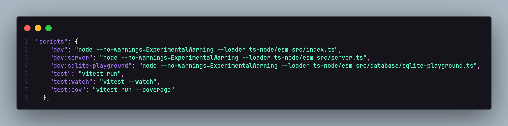
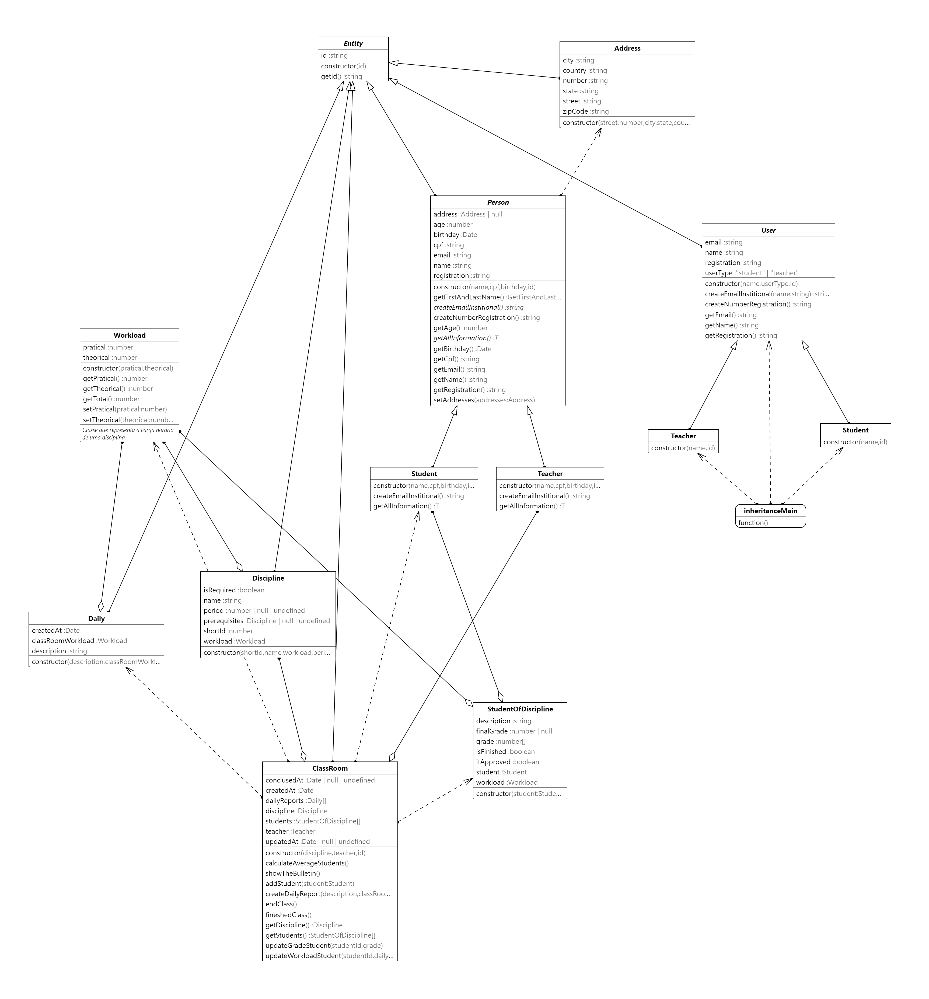

# My University 
O objetivo do projeto é apresentar os Fundamentos da Engenharia de Software, dando aos alunos a percepção da evolução após terem concluído uma avaliação de requisitos funcionais e não funcionais.

O próximo passo é usar diagramas de classes e casos de uso para codificação futura, testes e padrões de design e arquitetura, aplicando assim todos os conceitos básicos da Engenharia de Software.

## Para rodar o projeto (Windows)

### Requisitos

Método 1:
- [Node.js](https://nodejs.org/en/) Faça o download e instale o Node.js
- [Git](https://git-scm.com/) Faça o download e instale o Git
- [Visual Studio Code](https://code.visualstudio.com/) Faça o download e instale o Visual Studio Code
- [Windows Terminal](https://www.microsoft.com/pt-br/p/windows-terminal/9n0dx20hk701?activetab=pivot:overviewtab) 

- Você pode baixar facilmente na Microsoft Store a maioria destes programas.

Método 2:
- [Instalação Automatizada](https://github.com/christiancesar/setup-env-development) Baixe o repositório clicando em `Code`, descompacte o arquivo zip e execute o arquivo `step-one.ps1` ao finalizar a instalação execute `step-two.ps2`, todos como administrador.

### Baixar e rodar o projeto

Método 1:
- Crie uma pasta dentro do seu diretório de preferência. Exemplo: `Documentos/Projetos`
- Dentro da pasta `Projetos` clique com o botão direito do mouse e selecione a opção `Abir no terminal`
- Ao abrir o terminal, execute o comando `git clone https://github.com/christiancesar/my-university-oop.git`
- Após o download do projeto, execute o comando `cd my-university-oop`
- Execute o comando `npm install`
- Execute o comando `npm dev`
- Pronto! o projeto estará rodando e mostrará informações em seu terminal.
- Para acessar os códigos do projeto para que você pode visualizar e editar, abra o Visual Studio Code e clique em `Arquivo > Abrir Pasta` e selecione a pasta `my-university-oop` que foi baixada. Ou ainda em seu terminal execute o comando `code .` o projeto será aberto no Visual Studio Code.

Método 2:
- Baixe o projeto em https://github.com/christiancesar/my-university-oop.git, no repositório clique em Code e faça o download do arquivo zip.
- Descompacte o arquivo zip em uma pasta de sua preferência.
- Dentro da pasta onde o projeto foi descompactado clique com o botão direito do mouse e selecione a opção `Abir no terminal`, irá abrir no diretório do projeto.
- Execute o comando `npm install`
- Execute o comando `npm dev`
- Pronto! o projeto estará rodando e mostrará informações em seu terminal.
- Para acessar os códigos do projeto para que você pode visualizar e editar, abra o Visual Studio Code e clique em `Arquivo > Abrir Pasta` e selecione a pasta `my-university-oop` que foi baixada. Ou ainda em seu terminal execute o comando `code .` o projeto será aberto no Visual Studio Code.

## Tipos de scripts
Dentro do projeto encontram-se os seguintes scripts:



- `npm run dev` - Inicia o projeto executando o arquivo `index.js`, que tem exemplos de Programação Orientada a Objetos.
- `npm run dev:server`: Inicia o projeto executando o arquivo `server.js`, que tem exemplos de uma aplicação no formatado Cliente/Servidor, no qual é aplicado alguns Padrões de Projetos e conceitos como SOLID.
- `npm run dev:sqlite-playground`: Inicia o projeto executando o arquivo `sqlite-playground.js`, que tem exemplos de como utilizar o banco de dados SQLite. Local onde pode testar comandos SQL com o Nodejs e verificar o retorno.
- `npm run test` - Inicia os testes do projeto.

## Diagrama de Classes

O diagrama de classes é uma representação gráfica das classes de um sistema e dos relacionamentos entre elas. Ele é um dos diagramas mais populares da UML e é usado para modelar a estrutura de um sistema.


## Organização do Projeto

```text
MY-UNIVERSITY-OOP
 ┣ assets
 ┃  ┣ class-diagram.png
 ┃  ┗ materias.csv
 ┣ docs
 ┃  ┣ documentation.md
 ┃  ┣ entities_diagram.png
 ┃  ┣ scripts.png
 ┃  ┗ src_diagram.png
 ┣ src
 ┃  ┣ database
 ┃  ┃  ┣ providers
 ┃  ┃  ┃  ┣ connection.ts
 ┃  ┃  ┃  ┗ sqlite-connection-database.ts
 ┃  ┃  ┣ repositories
 ┃  ┃  ┃  ┣ dtos
 ┃  ┃  ┃  ┃  ┣ create-address-dto.ts
 ┃  ┃  ┃  ┃  ┣ create-discipline-dto.ts
 ┃  ┃  ┃  ┃  ┣ create-university-dto.ts
 ┃  ┃  ┃  ┃  ┣ find-address-by-id-dto.ts
 ┃  ┃  ┃  ┃  ┣ find-discipline-by-id-dto.ts
 ┃  ┃  ┃  ┃  ┗ find-university-by-id-dto.ts
 ┃  ┃  ┃  ┣ in-memory
 ┃  ┃  ┃  ┃  ┣ in-memory-class-room-repository.ts
 ┃  ┃  ┃  ┃  ┣ in-memory-disciplines-repository.ts
 ┃  ┃  ┃  ┃  ┗ in-memory-students-repository.ts
 ┃  ┃  ┃  ┣ interfaces
 ┃  ┃  ┃  ┃  ┣ addresses-repository.ts
 ┃  ┃  ┃  ┃  ┣ disciplines-repository.ts
 ┃  ┃  ┃  ┃  ┗ universities-repository.ts
 ┃  ┃  ┃  ┣ pgsql
 ┃  ┃  ┃  ┃  ┗ universities-repository-pg.ts
 ┃  ┃  ┃  ┗ sqlite
 ┃  ┃  ┃     ┣ helper
 ┃  ┃  ┃     ┃  ┗ verify-integrity-database-tables.ts
 ┃  ┃  ┃     ┗ implementations
 ┃  ┃  ┃        ┣ addresses-repository-sqlite.ts
 ┃  ┃  ┃        ┣ disciplines-repository-sqlite.ts
 ┃  ┃  ┃        ┗ universities-repository-sqlite.ts
 ┃  ┃  ┣ sql
 ┃  ┃  ┃  ┣ address.sql
 ┃  ┃  ┃  ┣ class-room-to-students.sql
 ┃  ┃  ┃  ┣ class-room-to-teachers.sql
 ┃  ┃  ┃  ┣ class-room.sql
 ┃  ┃  ┃  ┣ dailies.sql
 ┃  ┃  ┃  ┣ discipline.sql
 ┃  ┃  ┃  ┣ person.sql
 ┃  ┃  ┃  ┣ student.sql
 ┃  ┃  ┃  ┣ teacher.sql
 ┃  ┃  ┃  ┣ university_to_students.sql
 ┃  ┃  ┃  ┣ university_to_teachers.sql
 ┃  ┃  ┃  ┗ university.sql
 ┃  ┃  ┗ sqlite-playground.ts
 ┃  ┣ entities
 ┃  ┃  ┣ inheritance-examples
 ┃  ┃  ┃  ┣ index.ts
 ┃  ┃  ┃  ┣ student-inheritance.ts
 ┃  ┃  ┃  ┣ teacher-inheritance.ts
 ┃  ┃  ┃  ┗ user.ts
 ┃  ┃  ┣ address.ts
 ┃  ┃  ┣ class-room.ts
 ┃  ┃  ┣ daily.ts
 ┃  ┃  ┣ discipline.ts
 ┃  ┃  ┣ entity.ts
 ┃  ┃  ┣ person.ts
 ┃  ┃  ┣ student-discipline.ts
 ┃  ┃  ┣ student.ts
 ┃  ┃  ┣ teacher.ts
 ┃  ┃  ┗ workload.ts
 ┃  ┣ errors
 ┃  ┃  ┗ AppError.ts
 ┃  ┣ factories
 ┃  ┃  ┣ class-room-factory.ts
 ┃  ┃  ┣ discipline-factory.ts
 ┃  ┃  ┣ person-factory.ts
 ┃  ┃  ┣ student-factory.ts
 ┃  ┃  ┗ teacher-factory.ts
 ┃  ┣ middlewares
 ┃  ┃  ┗ interceptErrorMiddleware.ts
 ┃  ┣ model
 ┃  ┃  ┣ address.ts
 ┃  ┃  ┣ discipline.ts
 ┃  ┃  ┗ university.ts
 ┃  ┣ seeds
 ┃  ┃  ┣ diciplines-seed.ts
 ┃  ┃  ┗ students-seed.ts
 ┃  ┣ use-cases
 ┃  ┃  ┗ create-university-use-case.ts
 ┃  ┣ utils
 ┃  ┃  ┗ env
 ┃  ┃     ┗ environment.ts
 ┃  ┣ index.ts
 ┃  ┣ routes.ts
 ┃  ┗ server.ts
 ┣ tests
 ┃  ┣ class-room.spec.ts
 ┃  ┣ disciplines.spec.ts
 ┃  ┗ students.spec.ts
 ┣ .env
 ┣ .gitignore
 ┣ package-lock.json
 ┣ package.json
 ┣ readme.md
 ┣ tsconfig.json
 ┣ university.db
 ┗ vitest.config.ts

```
